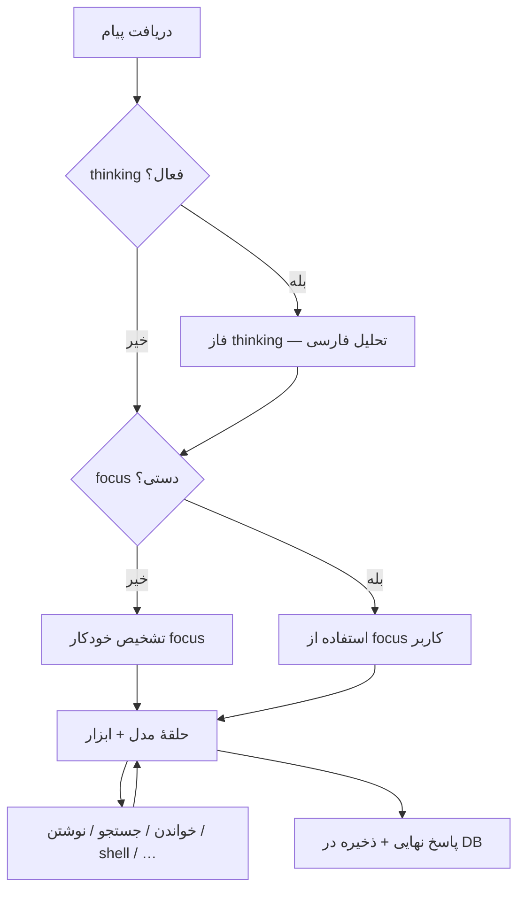

# Autonomous Coding Agent

پلتفرم agent چندپروفایلی برای کاربران ایرانی — workspace واقعی، API [گپ‌جی‌پی‌تی](https://gapgpt.app/)، زمان‌بندی، **thinking**، و **تشخیص خودکار focus**.

## Agentها

| شناسه | کاربرد |
|--------|--------|
| `coding` | کد، git، تست، lint، checkpoint (پیش‌فرض) |
| `seo` | تحلیل SEO و گزارش |
| `social` | تلگرام / اینستاگرام + زمان‌بندی |
| `autonomous` | همهٔ ابزارها |

## پیش‌نیاز

- Python 3.11+
- کلید API گپ‌جی‌پی‌تی
- (پیشنهادی) [ripgrep](https://github.com/BurntSushi/ripgrep)، `git`، `patch`

## نصب

```bash
cd Autonomous_Coding_Agent
python3 -m venv .venv && source .venv/bin/activate
pip install -r requirements.txt
cp .env.example .env
python manage.py migrate
python manage.py createsuperuser
python manage.py runserver
```

### worker زمان‌بند

```bash
python manage.py run_scheduler
```

### تست

```bash
python manage.py test tests
```

---

## محدودهٔ focus (خودکار vs دستی)

| وضعیت | رفتار |
|--------|--------|
| **بدون chip روی پوشه** و بدون scope پیش‌فرض پروژه | agent مسیرهای پیشنهادی (focus خودکار) می‌گیرد تا **اول** آنجا جستجو کند؛ اما **می‌تواند در هر جای پروژه** فایل بخواند/بنویسد. |
| **Shift+کلیک** روی پوشه یا scope ذخیره‌شده | **اولویت کامل با کاربر** — auto-focus اجرا نمی‌شود. |

---

## بعد از ارسال یک پیام چه می‌شود؟

ترتیب تقریبی (در UI با خط زرد «مرحلهٔ فعلی» و ردیف‌های بنفش «مرحله» دیده می‌شود):



1. **دریافت پیام** — بارگذاری تاریخچه و پرامپت agent.
2. **thinking** (اگر تیک خورده) — یک تماس جدا به API **بدون ابزار**؛ تحلیل هدف، برنامه، ریسک (فارسی). در پنل کناری «فاز thinking» نمایش داده می‌شود.
3. **تشخیص focus** (فقط اگر شما پوشهٔ focus انتخاب نکرده‌اید) — مدل از روی درخواست و ساختار پروژه چند مسیر برمی‌گرداند؛ ابزارها خارج از آن مسیرها خطا می‌گیرند.
4. **برنامه‌ریزی** — مدل با `tool_choice=auto` تصمیم می‌گیرد کدام ابزار را صدا بزند (چند «دور» تا سقف **حداکثر دور ابزار**).
5. **اجرای ابزار** — هر بار مرحله در UI مشخص است (مثلاً «خواندن فایل»، «نوشتن فایل»، «اجرای shell»).
6. **نوشتن پاسخ** — وقتی مدل ابزار نخواهد، متن نهایی تولید و مکالمه ذخیره می‌شود.

با **استریم** روشن، همین مراحل به‌صورت رویداد SSE (`phase`, `thinking`, `focus_inferred`, `tool_*`) زنده می‌آیند.

---

## گزینه‌های پایین فرم چت

| گزینه | کارکرد |
|--------|--------|
| **نوشتن فایل** | اگر خاموش باشد، ابزارهای `write_file`, `apply_patch`, `delete_file`, `git_commit`, checkpoint و… با خطای `allow_write=false` متوقف می‌شوند. agent فقط می‌تواند بخواند و تحلیل کند. |
| **shell** | اگر خاموش باشد، `run_shell`, `run_tests`, `format_lint` و هر اجرای ترمینالی مسدود است. برای محیط‌های حساس توصیه می‌شود بعد از اتمام کار خاموش شود. |
| **استریم** | روشن: `POST /api/chat/stream/` و نمایش **مرحلهٔ فعلی** + ابزارها زنده. خاموش: یک درخواست `/api/chat/` و پاسخ یک‌جا (همان `phase_log` در JSON). |
| **thinking** | قبل از ابزارها یک فاز تحلیل جدا (بدون تغییر فایل). برای پروژه‌های بزرگ و درخواست‌های مبهم مفید است. هزینهٔ API بیشتر (حداقل یک تماس اضافه). |
| **تحلیل عمیق** | همان thinking با پرامپت طولانی‌تر (وابستگی‌ها، edge case، ترتیب تست). کندتر و پرهزینه‌تر از thinking معمولی. |
| **حداکثر دور ابزار** | سقف تعداد دفعات «مدل → ابزار → مدل» در **یک پیام**. مقدار کم = پاسخ سریع‌تر ولی ممکن است کار نیمه‌کاره بماند؛ زیاد = refactorهای بزرگ‌تر ممکن است. پیش‌فرض از `AGENT_MAX_TOOL_ROUNDS` در `.env`. |

مدل جدا برای thinking/focus (اختیاری): `GAPGPT_THINKING_MODEL`, `GAPGPT_FOCUS_MODEL` در `.env`.

---

## ابزارهای اصلی

| گروه | نام‌ها |
|------|--------|
| Workspace | `project_tree`, `list_directory`, `glob_files`, `search_code`, `read_file`, `apply_patch`, `apply_unified_diff`, `write_file`, `delete_file`, `move_file`, `run_shell` |
| کد | `git_*`, `run_tests`, `format_lint`, `web_fetch`, `project_note`, `checkpoint_*` |
| SEO | `analyze_html_seo`, `audit_site_seo_basics`, `analyze_content_keywords`, `save_seo_report` |
| زمان‌بندی | `schedule_job`, `list_scheduled_jobs`, `cancel_scheduled_job` |
| شبکه | `telegram_login`, `instagram_login` |

یادداشت پروژه: `.agent/PROJECT_MEMORY.md`

## ابزارهای سفارشی (فقط همان پروژه)

اگر ابزار پایه کافی نبود، agent می‌تواند با **`create_project_tool`** ابزار بسازد:

- ذخیره در `{پروژه}/.agent/custom_tools/manifest.json` + `tools/{tool_id}.py`
- فقط وقتی `conversation` به یک `project` وصل است (`project_id` در اجرا)
- در همان مکالمه بعد از ثبت، ابزار به لیست tools مدل **اضافه** می‌شود (پروژهٔ دیگر آن را نمی‌بیند)
- **`list_project_tools`** / **`test_project_tool`** برای مدیریت و تست
- `source_body`: بدنهٔ `run` — فقط `return tool_result(True/False, "...")` با importهای محدود (بدون `os`/`subprocess`)

مراحل در **phase-log**: `custom_tool_build` → `custom_tool_register` → `custom_tool_test`.

## دیباگ خودکار (همان پروژه)

وقتی خروجی ابزار با **`ERROR:`** شروع شود، ایجنت به‌ترتیب این کارها را می‌کند:

1. **تلاش عادی** — همان خطا به مدل برمی‌گردد تا رویکرد را عوض کند.  
2. **hint** — از بار دوم همان خطا (`AGENT_DEBUG_HINT_THRESHOLD`، پیش‌فرض ۲) راهنمای `[ACA Debug — خطای تکراری]` بدون فراخوانی اضافهٔ مدل.  
3. **recover** — از آستانه (`AGENT_DEBUG_RETRY_THRESHOLD`، پیش‌فرض ۳): **debug_analyze** + **debug_strategy** و تزریق `[ACA Debug — راه‌حل جایگزین]` (حداکثر **`AGENT_DEBUG_MAX_RECOVERIES`** بار، پیش‌فرض ۲).  
4. **escalate** — اگر بعد از اتمام بازیابی همان خطا تکرار شد: **debug_escalate**، پاسخ فارسی برای کاربر (علت، جزئیات، پیشنهاد) و توقف اجرا؛ «از این نقطه بر عهدهٔ کاربر است».

لاگ تلاش‌ها در `ProjectDebugState.attempts` و آخرین تحلیل/ارجاع در `last_recovery` (دیتابیس).

## امنیت

- `allow_shell` / `allow_write` در UI
- مسدودسازی دستورات خطرناک در shell
- `AGENT_PROJECT_PATH_ALLOWLIST` — محدود کردن مسیر پروژه‌ها
- `AGENT_API_TOKEN` + هدر `X-ACA-Token` برای API

## معماری

```
UI → loop.py → thinking? → auto-focus? → گپ‌جی‌پی‌تی (tools)
         ↓
  agent/agents/* + agent/tools/*
```

`GET /api/agents/` — لیست agentها.
